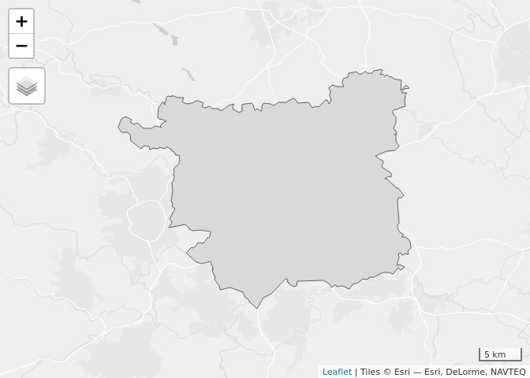
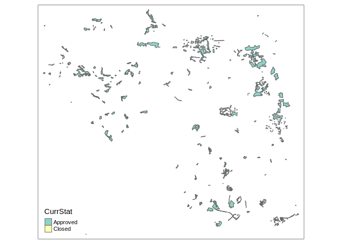
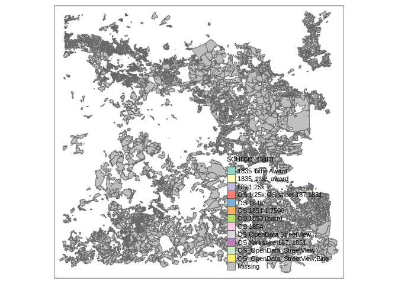

<!-- README.md is generated from README.Rmd. Please edit that file -->

# uklandusedata

<!-- badges: start -->

<!-- badges: end -->

The goal of uklandusedata is to show how to get open land data for
mapping with open source software such as R and QGIS.

It is a work in progress and does not aim to be comprehensive, it’s a
big topic\!

``` r
library(sf)
#> Linking to GEOS 3.8.0, GDAL 3.0.2, PROJ 6.2.1
library(tmap)
tmap_mode("view")
#> tmap mode set to interactive viewing
```

# Choose region of interest

We will get data for the following region (should work for any region in
the UK):

``` r
region = osmdata::getbb(place_name = "leeds", format_out = "sf_polygon")
qtm(region$polygon$geometry[1])
```

<!-- -->

``` r
region = region$polygon$geometry[1]
region_27700 = st_transform(region, 27700)
```

# Woodland grant scheme and wood-pasture and parkland inventory data

To download data from the woodland grant and wood-pasture inventory
datasets run the following code.

``` r
# source("r-code/get-estates-data.R")

if(!file.exists("English_Woodland_Grant_Scheme.Rds")) {
  download.file("https://github.com/Robinlovelace/uklandusedata/releases/download/0.0.1/English_Woodland_Grant_Scheme.Rds", "English_Woodland_Grant_Scheme.Rds")
}

w = readRDS("English_Woodland_Grant_Scheme.Rds")
w_region = w[region_27700, ]
qtm(w_region)
saveRDS(w_region, "w_leeds.Rds")
sf::write_sf(w_region, "w_leeds.gpkg")
piggyback::pb_upload("w_leeds.Rds")
piggyback::pb_upload("w_leeds.gpkg")
```

To get the data saved in the previous step for a specific region you can
do:

``` r
download.file(
  "https://github.com/Robinlovelace/uklandusedata/releases/download/0.0.1/w_leeds.gpkg",
  "w_leeds.gpkg"
)
w_region = sf::read_sf("w_leeds.gpkg")
head(w_region)
#> Simple feature collection with 6 features and 8 fields
#> geometry type:  MULTIPOLYGON
#> dimension:      XY
#> bbox:           xmin: 425794.4 ymin: 428204.3 xmax: 447075.5 ymax: 443963.2
#> epsg (SRID):    NA
#> proj4string:    +proj=tmerc +lat_0=49 +lon_0=-2 +k=0.9996012717 +x_0=400000 +y_0=-100000 +ellps=airy +units=m +no_defs
#> # A tibble: 6 x 9
#>   OBJECTID CaseRef PropName FSArea CaseType DateApprv CurrStat AreaHa
#>      <dbl>   <dbl> <chr>    <chr>  <chr>    <chr>     <chr>     <dbl>
#> 1     1829    2929 Forest … Yorks… EWGS     2006-11-… Approved   4.86
#> 2      312     665 Garfort… Yorks… EWGS     2006-03-… Approved   1.03
#> 3     2568   14915 Lothert… Yorks… EWGS     2007-09-… Approved   2.12
#> 4     2665   15047 Lothert… Yorks… EWGS     2008-01-… Closed   149.  
#> 5     2955   15515 Creskel… Yorks… EWGS     2008-01-… Approved  12.6 
#> 6     2970   15544 Hayton … Yorks… EWGS     2008-01-… Closed   105.  
#> # … with 1 more variable: geom <MULTIPOLYGON [m]>
plot(w_region)
```

<!-- -->

And to make an interactive map, try:

``` r
tm_shape(w_region) +
  tm_polygons("CurrStat") +
  tm_basemap(leaflet::providers$CartoDB.Positron)
#> Warning: The shape w_region is invalid. See sf::st_is_valid
```

<!-- -->

## Data from OSM

We can also get data from OpenStreetMap. A good way to do that is via
the QuickOSM plugin in QGIS.

From that the following dataset was generated:

``` r
landuse_farm_polygons = sf::read_sf("landuse_farm_polygons.gpkg")
tm_shape(landuse_farm_polygons) +
  tm_polygons("source_nam")
#> Warning: The shape landuse_farm_polygons is invalid. See sf::st_is_valid
```

<!-- -->
